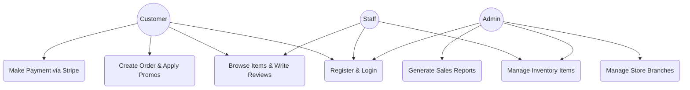
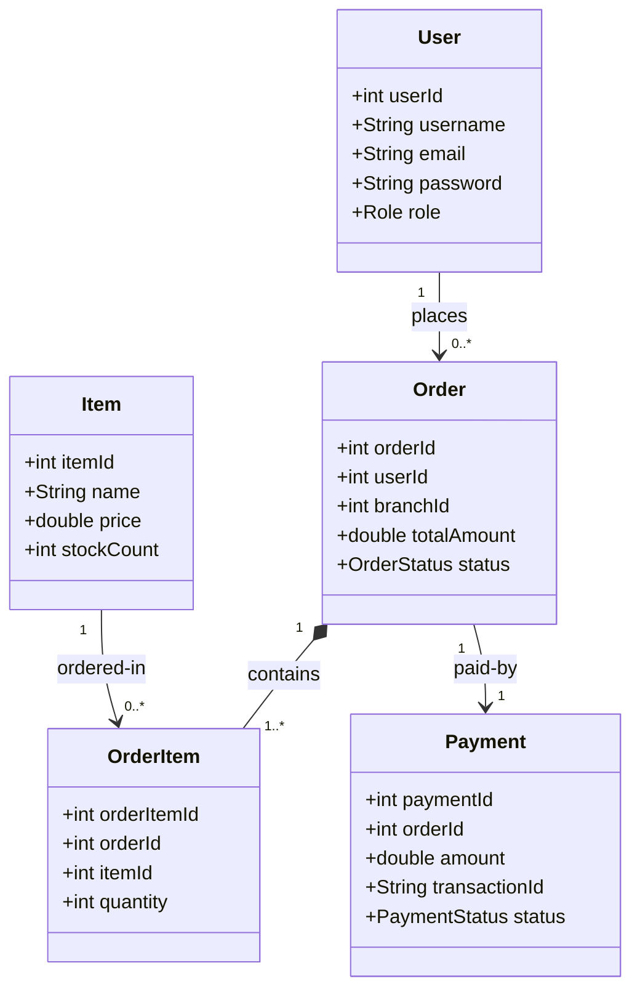
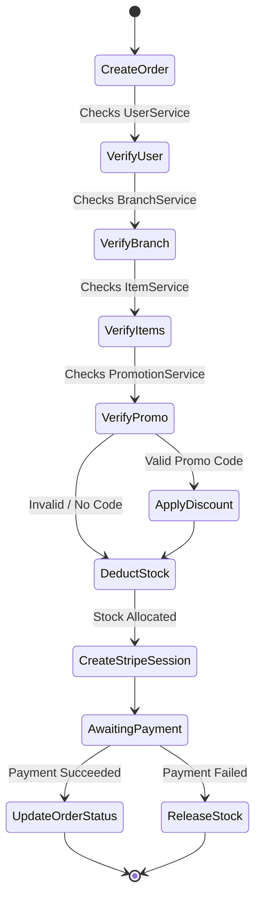

# Online Supermarket Shopping Management System
## Backend Service Engine & API Architecture

**Course:** IT-3003 Software Engineering Mini Project
**Team Members:**
* Thinula Harischandra (17478) | Janindu Hasaranga (17472) | Ruchitha Vithana (17450)
* Anshumala Amarawansa (17452) | Dinuvi Laknara (17541) | Himandi Ranawaka (17514)
* Prabhavi Jayawardana (17485)

---

## 1. Project Introduction

### System Overview
An enterprise-grade, REST-compliant backend platform managing catalog inventories, customer checkout pipelines, promotions, store branch routing, product reviews, and secure checkout payments.

### Problem Statement & Motivation
* **Queue Latencies:** Traditional supermarkets suffer from slow on-site checkouts.
* **Inventory Desynchronization:** Out-of-stock orders occur due to lagged database records.
* **Tightly Coupled Architectures:** High dependency between software subsystems prevents parallel engineering.

### Project Objectives
* Implement a **fully decoupled, micro-modular backend architecture** using Java & Spring Boot.
* Coordinate secure external payment validations via **Stripe API integration**.
* Design flat identity-based relationships to enable parallel development.

---

## 2. Technology Stack

* **Programming Language:** Java 17
* **Framework:** Spring Boot 3.4.1 (Spring Web, Spring Data JPA, Jakarta Validation)
* **Database Management System:** PostgreSQL (Hosted on Supabase Cloud)
* **Configuration Loader:** `spring-dotenv` (supports externalized `.env` configurations)
* **Payment Processing Integration:** Stripe Java SDK (`v28.1.0`)
* **Integrated Development Environment (IDE):** IntelliJ IDEA
* **Version Control System:** GitHub

---

## 3. System Features & Functionalities

* **Identity Management:** Role-based access control supporting Admins, Staff, and Customers.
* **Catalogue Management:** Live item stock tracking with optimistic lock-checks on checkout.
* **Promo Engine:** Discount coupons dynamically applied and subtracted from order subtotals.
* **Order Pipeline:** Cart verification, branch assignment, item stock allocation, and order generation.
* **Payment Gateway:** Secure creation of checkout sessions using Stripe.
* **Feedback Engine:** Customers submit verified reviews and ratings.

---

## 4. Use Case Diagram



---

## 5. Class Diagram (Core Structural Model)



---

## 6. Checkout Workflow (Activity Diagram)



---

## 7. CRUD Operations by Group Member

### User & Authentication Module (Thinula - 17478)
* **C:** User registration (Customer, Staff, Admin creation).
* **R:** Fetch profiles by ID, authentication validation (`LoginRequest`).
* **U:** Update user info (excluding passwords).
* **D:** Disable or delete profiles.

### Branch Module (Janindu - 17472)
* **C:** Create new physical supermarket branches.
* **R:** Retrieve branch list, filter by status or location.
* **U:** Modify branch locations, phone numbers, and operational status.
* **D:** Delete branches.

---

## 8. CRUD Operations by Group Member (Cont.)

### Item Module (Anshumala - 17452)
* **C:** Add new catalog items / products.
* **R:** Retrieve products, search by categories or pricing filters.
* **U:** Adjust pricing, modify item descriptions, and update stocks.
* **D:** Remove items from catalog.

### Order Module (Ruchitha - 17450)
* **C:** Process checkouts (`/api/order/create`), orchestrating dependencies.
* **R:** Fetch order logs, retrieve order items by order ID.
* **U:** Transition order statuses (`PENDING`, `COMPLETED`, `CANCELLED`).
* **D:** Delete / Cancel pending orders.

---

## 9. CRUD Operations by Group Member (Cont.)

### Promotion Module (Dinuvi - 17541)
* **C:** Create discount coupons (`Promotion`) and campaign codes.
* **R:** Query coupons by code, retrieve discount values.
* **U:** Update promotional durations, change discount values.
* **D:** Delete expired promotions.

### Reviews Module (Himandi - 17514)
* **C:** Add reviews & rating stars to purchased items.
* **R:** Retrieve item reviews, calculate average scores.
* **U:** Edit review text and star ratings.
* **D:** Delete user-submitted reviews.

---

## 10. CRUD Operations by Group Member (Cont.)

### Payment Module (Prabhavi - 17485)
* **C:** Initialize transaction records, create Stripe sessions (`/stripe-session`).
* **R:** Get transaction details, fetch all payment logs.
* **U:** Update transaction status (`PENDING` -> `SUCCESS` or `FAILED`).
* **D:** Refund transactions (`REFUNDED`).

---

## 11. System Demonstration & Integration Flows

```
[ Frontend Client ] ──( 1. Post Order )──> [ OrderController ]
                                                  │
                                            ( 2. Validates )
                                                  │
                                                  ▼
[ Stripe Gateway ] <──( 3. Session URL )── [ PaymentController ]
        │
( Payment Success )
        │
        ▼
[ Database Update ] ──( 4. Log Success )──> [ supabase PostgreSQL ]
```

* **Live Demo Focus:** Checkout process, real-time inventory deduction, Stripe sandbox payment redirect, and invoice generation.

---

## 12. GitHub Repository Information

* **Repository URL:** [https://github.com/IT-3003/backend](https://github.com/IT-3003/backend)
* **Branches:** Module-specific branching (`feature/user`, `feature/order`, `feature/payment`, etc.) merged via PR reviews.
* **Local Run Instruction:**
  ```bash
  git clone https://github.com/IT-3003/backend
  cd backend
  ./mvnw spring-boot:run
  ```

---

## 13. Conclusion & Future Enhancements

### Key Takeaways
* Flat decoupled tables allowed team members to construct features without locking shared data.
* Integrating validation filters at the API boundaries prevented database pollution.

### Future Enhancements
* **Transition to Microservices:** Migration from modular monolith to independent microservices using Spring Cloud.
* **Real-time stock alerts:** WebSockets to notify inventory managers of low-stock thresholds.
* **AI-driven Recommendations:** Implement purchase recommendations based on customer shopping history.
